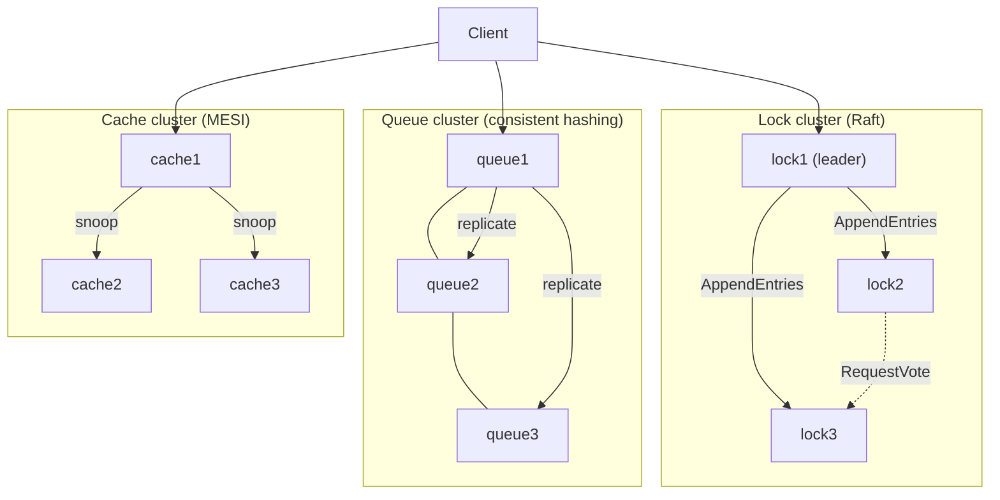
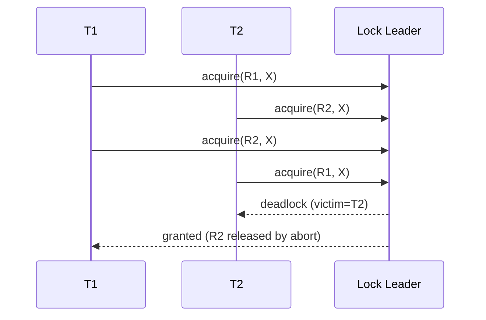
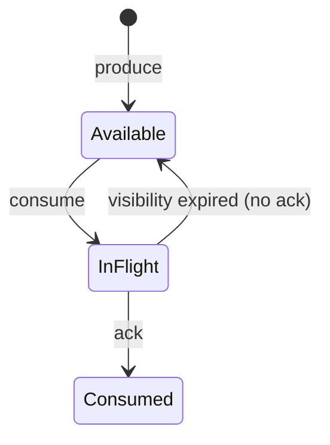

# Architecture

## Overview

Three independent distributed services share one transport layer (HTTP/JSON) and one cluster-config format. Each service is a small `aiohttp` server that exposes:

- a public client API (`/lock/*`, `/queue/*`, `/cache/*`)
- inter-node RPCs (`/raft/*` for the lock manager, `/queue/replicate` for the queue, `/cache/snoop_*` for the cache)
- operational endpoints (`/status`, `/healthz`, `/metrics`, `/metrics.json`)



## Distributed Lock Manager (Raft-backed)

### Why Raft

Locks require strong consistency: every node must agree on who holds what. Raft gives us linearizable replicated state with simple semantics: a single elected leader serializes all writes; followers replicate; commits require a majority. A minority partition cannot grant or release — the cluster simply pauses on that side until the partition heals, which is the desired behavior for a lock service.

### Lock state machine

```
LockEntry { resource, holders[], waiters[] }

Mode compatibility:
  current holders | requested S | requested X
  --------------- | ----------- | -----------
  none            | grant       | grant
  S only          | grant       | wait
  X               | wait        | wait
```

All mutations (`acquire`, `release`, `release_all`, `abort_waiter`) are submitted to Raft; the state machine deterministically applies them on every node. The leader resolves the awaiting client's HTTP response when its `request_id` is granted, denied (deadlock), or aborted (timeout).

### Deadlock detection

We maintain an implicit wait-for graph (waiter → holders, across all resources) and run DFS for back-edges after every state transition. The youngest waiter on a detected cycle is selected as the victim; its waits and held locks are released, and its outstanding request returns `deadlock`.



### Network partitions

| Partition | Majority side | Minority side |
| --- | --- | --- |
| 2/3 split (1 isolated) | Continues. New leader if needed. | Cannot commit; client requests fail with `not leader` or time out. |
| 1/2/2 split | Neither has majority — stalls correctly until quorum returns. | — |
| Heal | Stale entries on the minority are overwritten via `AppendEntries` consistency check. | — |

## Distributed Queue (consistent hashing + replication)

### Placement

The cluster builds a hash ring with `QUEUE_VIRTUAL_NODES` (default 128) virtual tokens per physical node. For a topic `T`, the primary is the first virtual token clockwise from `hash(T)`. Replicas are the next `REPLICATION_FACTOR-1` distinct physical nodes. Adding/removing a node only re-homes `1/N` of the topics on average.

### Durability

The primary appends each message to a per-topic write-ahead log (`<data>/queue/<node>/<topic>.log`) and `fsync`s before responding to the producer. It then synchronously fans out a `/queue/replicate` RPC to each replica. The producer ack also lists which replicas accepted.

### At-least-once delivery

Consumers request `count` messages with a `visibility_ms` timeout. The primary moves them to an in-flight table keyed by `(consumer_id, deadline)`. An explicit `/queue/ack` durably marks them consumed (offsets persisted). If the consumer fails to ack before the deadline, the message becomes available again.



### Failure handling

- Producer ack only requires the primary's local fsync. Replication may report partial success; the response includes `failed_replicas`.
- If a primary crashes after fsync, on restart it re-reads the WAL and resumes serving from the same `next_seq`.
- Without a global coordinator (queue uses no Raft), a permanent primary failure requires manual ring re-homing — a deliberate simplification.

## Distributed Cache (MESI)

Each cache node holds a bounded LRU/LFU table of `(value, MESI_state)` lines. The "memory" backing store is local to each node (a JSON file representing the per-node authoritative copy after writes). Reads/writes interact with peers via snoop RPCs.

| Local op | Local state | Bus traffic | New state |
| --- | --- | --- | --- |
| Read hit  | M / E / S    | none        | unchanged |
| Read miss | I            | BusRd       | S if any peer had it, else E |
| Write hit | M            | none        | M |
| Write hit | E            | none        | M |
| Write hit | S            | BusRdX (invalidate peers) | M |
| Write miss| I            | BusRdX      | M |

Snoop responses on remote operations:

| Local state | BusRd from peer | BusRdX from peer |
| --- | --- | --- |
| M | write back, downgrade to S | write back, invalidate |
| E | downgrade to S | invalidate |
| S | stay S | invalidate |
| I | no-op | no-op |

Eviction writes back `M` lines to local memory before discarding. `LRU` is the default; `LFU` is selected via the `CACHE_POLICY` env var.

## Cross-cutting

- **Transport**: aiohttp client/server with 300–800 ms timeouts. JSON bodies. No compression — readability matters more than wire size for this exercise.
- **Persistence**: write-ahead JSON-lines logs + `fsync`; small state (Raft term/voted_for, offsets) atomically replaced via `tmp + os.replace`.
- **Metrics**: in-process counters and summaries exposed on `/metrics` (Prometheus textual format) and `/metrics.json`.
- **Logging**: `structlog` JSON, level via `LOG_LEVEL`. Each component tags lines with its component name.
- **Failure detector**: simple heartbeat-threshold (`communication.failure_detector`); used today by metrics and operator tooling, available for future scheduling decisions.
